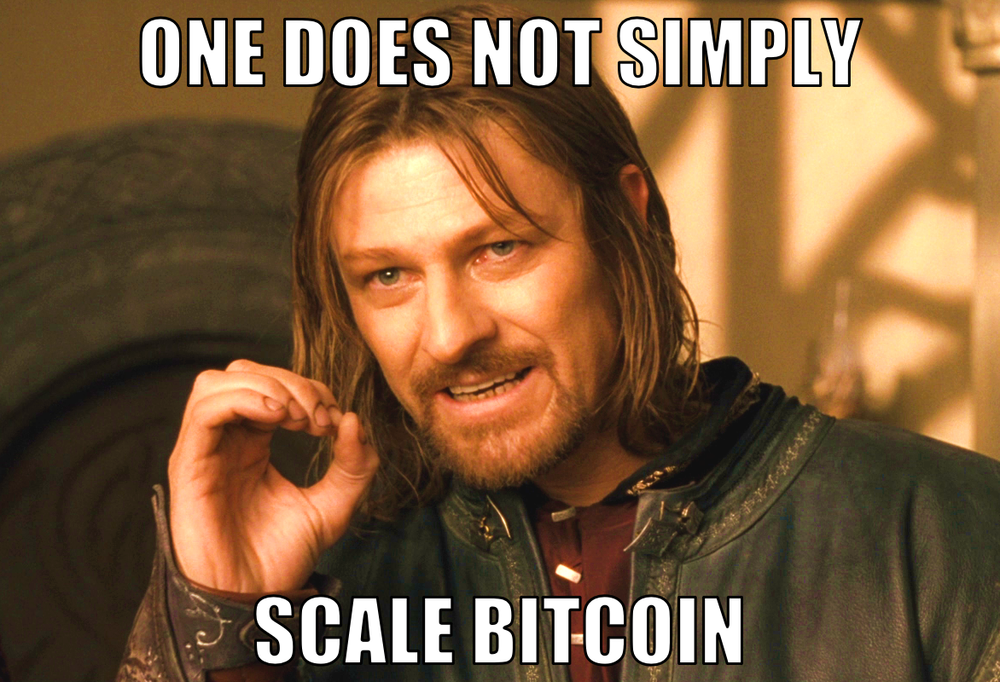
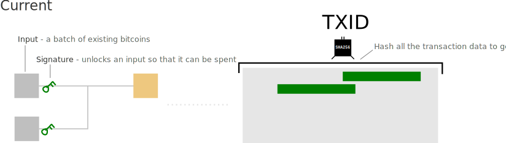
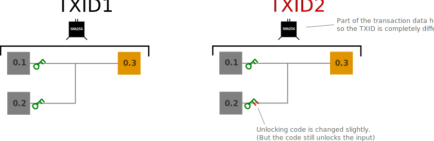
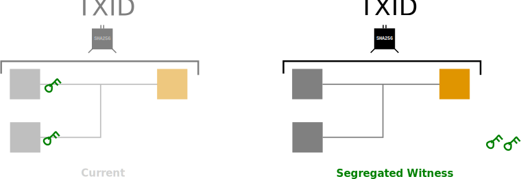

class: center, middle

## SegWit

### How We Got Here and What Happens Next



---

class: center, middle

# Please ask questions!

---

# Agenda

- Who I am

- On politics

- Technicals
  - Scaling bitcoin
  - Transaction malleability
  - Segregated witness
  - UASF
  - Segwit2x

- Timeline
  - How we got here
  - What might happen next

- Predictions

- How to keep keep your coins safe while the dumpster fire burns itself out

---

# I'm just this guy, you know?

- Berkeley CS '09 🐻

- Cryptocurrency fanatic since 2013

- Worked at Chain Code Labs contributing to Bitcoin Core in 2015

---

class: center, middle

# On Politics

---

class: center, middle

# Technicals:
# Scaling bitcoin

---

#### Technicals: Scaling bitcoin

### Current block size limit

- 1,000,000 bytes (1MB)

- Introduced by Satoshi in 2010

- Not mentioned in release notes

- Blocks started hitting limit around October, 2016

---

#### Technicals: Scaling bitcoin

### Why not just increase the block size?

Increased block latency:

- Larger blocks take longer to propagate

- More time mining on top of "stale" blocks

- More time mining stale blocks means less hash power securing the network

- Incentivizes miners to be close together on the network

---

#### Technicals: Scaling bitcoin

### Why not just increase the block size?

Not all bytes in a block are equally "expensive":

- Bytes that increase the size of the unspent transaction output
    set (UTXO set) are most expensive

  - UTXO set must be kept in memory to quickly verify that new
      transactions are valid

- Signature data (also called witness data) is "cheapest":
  - Can be discarded after verifying
  - Do not enter the UTXO
  - Authorize spending of transactions, thus potentially reducing
      the size of the UTXO set

- Important to align transaction costs and resource costs

---

#### Technicals: Scaling bitcoin

### Why not just increase the block size?

Quadratic hashing vulnerability:

- Currently possible to create monster sized transactions that
    take a long time to verify

- Okay at 1MB, but becomes a problem as block size increases

- This can be fixed in other ways, but prevents simple bump to
    block size

---

#### Technicals: Scaling bitcoin

### Why not just increase the block size?

Some fee pressure is desirable:

- Bitcoin provides extremely durable, widely replicated storage

- Whatever the block size, transaction volume will eventually grow to fill it

- A limited block size prevents a huge volume of "low value"
    transactions from bloating the block chain

- Very subjective!

---

#### Technicals: Scaling bitcoin

### Why not just increase the block size?

Be wary of powerful attackers:

- Cryptocurrencies are in their infancy, but may come to challenge the
    legacy monetary and financial system

- This could pose an existential threat to very powerful actors,
    such as nation states and banks, who might seek to destroy it

- An increased block size increases the resources needed to run a
  full node, centralizing their operation and making them
  vulnerable to attack

---

class: center, middle

# Technicals:
# Transaction Malleability

---

#### Transaction malleability

### Transaction IDs

- Transaction data is hashed to produce transaction ID

- ID looks like `0xb14d...6130`

- Currently, signatures are part of hashed data:



###### Image from http://learnmeabitcoin.com/faq/segregated-witness

---

#### Transaction malleability

### Signatures are malleable

- The bits in a signature can be changed without invalidating it

- Can be done without access to private key

- Transaction ID will be completely different



###### Image from http://learnmeabitcoin.com/faq/segregated-witness

---

#### Technicals: Transaction Malleability

### Fixing TX malleability will make bitcoin more awesome

- Conditional transactions become easier:
  - "If transaction 0xF123D... is confirmed, do this..."

- Simplifies hardware and software wallet implementation

- Makes the lightning network much better and easier to implement

  Lightning network is _awesome_:
    - Micro transactions
    - Instant confirmation
    - Cross-chain atomic swaps

---

class: center, middle

# Technicals:
# Segregated witness

---

#### Technicals: Segregated witness

- Moves signatures out of transactions and into a separate structure

- Pre-segwit nodes can't see the witness data, to them, segwit
    transactions appear as anyone-can-spend transactions

- Because of the above, can be implemented as a soft-fork 

- Signatures make up 60% of the block chain, so increase can be
    significant

- Signature data stored in merkle tree with root in coinbase
    transaction

---

#### Technicals: Segregated witness

- Signatures are no longer part of data that determines txid hash

- Fixes all known sources of transaction malleability

<br>
<br>
<br>


###### Image from http://learnmeabitcoin.com/faq/segregated-witness

---

#### Technicals: Segregated witness

- As discussed before, signature data is less expensive than other
    transaction data

- Signature says that a transaction is authorized, but not what
    its effects are

- Only needed once, and then when bootstrapping new nodes

- Signatures authorize spending prior unspent transactions, thus
    allowing them to be removed from the UTXO set

- More signatures in TX = more reduction of UTXO set, thus makes
    sense to give them a discount

---

#### Technicals: Segregated witness

### The block weight formula

- Under segwit, 1,000,000 byte block size limit is replaced with
4,000,000 unit block weight limit:
  
  `block weight = base size * 3 + total size`

- Examples:
  - pre-segwit block with 1MB of base block data and no witness data:
  
      ```
      1,000,000 byte base size
      1,000,000 byte total size

      1,000,000 * 3 + 1,000,000 = 4,000,000 weight units
      ```

  - segwit block with 0.5MB of base block data and 1MB of witness data:
      
      ```
        500,000 byte base size
      1,500,000 byte total size

      500,000 * 3 + 2,000,000 = 3,500,000 weight units
      ```

- 4MB blocks possible, but 2.1MB blocks expected in practice

---

#### Technicals: Segregated witness

### Signature versioning

- Segwit adds a version byte to signatures

- New kinds of signatures can be added in future soft forks

- Paves the way for Schnorr signatures:
  - Faster to verify
  - Multiple signatures can be aggregated, improving scalability
  - Incentivizes coinjoin, improving privacy
  - Estimated to be a 40% capacity increase _on top of_ segwit increase

---

#### Technicals: Segregated witness

### Current segwit deployment: BIP 141

- Activates out using method described in BIP 9

- Chance to activate every 2016 blocks, coinciding with difficulty
    adjustment period

- 2016 blocks is ~2 weeks

- If 95% of blocks signal during that period, segwit will be
    locked in

- An additional 2 week period passes after lock in, at which point
    segwit activates

- Expires if not activated within two years

---

#### Technicals: Segregated witness

### Arguments for segwit

- Soft fork, so doesn't require whole network to upgrade

- Aligns incentives with resources costs

- Paves way for on-chain scaling improvements

- Paves way for layer-two scaling improvements

- Disables covert asic boost

- Ready now!

---

#### Technicals: Segregated witness

### Arguments against segwit

- Soft-fork is hacky

- Soft-fork means users must opt-out to retain status quo

- Anyone-can-spend transactions are an attack vector

- Unfair to non-segwit transactions

- Further incentivizes validationless mining

---

#### ~~Technicals~~ Opinions: Segregated witness

### My opinion on segwit and the scaling debate

- A 2x or even 10x block size incrase doesn't enable new use
    cases, but off-chain scaling does

- Efficiency before capacity

- A bitcoin that can run on a rasberry pis is stronger and
    more resiliant than one that can only run in a data center

- Good idea to wait for IBLT and weak / thin / soft blocks before
-   block size increase
  
- Centralization has momentum

---


class: center, middle

# Technicals:
# User Activated Soft Fork

---

#### Technicals: User Activated Soft Fork

- Proposed in BIP 148 by Shaolin Fry

- Attempts to lock in current BIP 9 segwit deployment by
    orphaning non-segwit signalling blocks starting on August 1st

- UASF chain have at least 15% of hash power to lock in segwit
    before it expires on November 15th

- Non-UASF chain can re-org into UASF chain, but reverse is not
    true

---

class: center, middle

# Technicals:
# Segwit2x

---

#### Technicals: Segwit2x

- Spearheaded by Barry Silbert and Digital Currency Group

- Attempts to lock in current BIP 9 segwit deployment by orphaning
    non-segwit signalling blocks, just like UASF

- Activation method is BIP 91:
    - Activation window every 336 blocks (2.3 days)
    - Locks in if 80% blocks in an activation window signal
    - Activates one window later

- Includes provisions to hard fork to a 2MB base block size 3 months
    after segwit activates 

- Impossible to make hard fork conditional on soft fork

---

class: center, middle

# Timeline

---


<div class="timeline">
  <div class="timeline-legend">
    <span>2010</span>
    <span>2018</span>
  </div>

  <div class="timeline-container timeline-past">
    <div class="timeline-elapsed"   style="flex-grow: 0.0;"></div>
    <div class="timeline-remaining" style="flex-grow: 1.0;">
      <div class="timeline-current"></div>
    </div>
  </div>

  <div class="timeline-current-date" style="left: 0.0%;">
    ·July 15th, 2010
  </div>
</div>

<div class="timeline-header">
  <h3>Bitcoin 0.3.1 - First release with block size limit</h3>
</div>


<div class="capture" style="background-image: url('captures/0-full.jpg');"></div>


---


<div class="timeline">
  <div class="timeline-legend">
    <span>2010</span>
    <span>2018</span>
  </div>

  <div class="timeline-container timeline-past">
    <div class="timeline-elapsed"   style="flex-grow: 0.106810569408262;"></div>
    <div class="timeline-remaining" style="flex-grow: 0.8931894305917379;">
      <div class="timeline-current"></div>
    </div>
  </div>

  <div class="timeline-current-date" style="left: 10.6810569408262%;">
    ·April 28th, 2011
  </div>
</div>

<div class="timeline-header">
  <h3>Satoshi Disappear Day</h3>
</div>


<div class="capture" style="background-image: url('captures/1-full.jpg');"></div>


---


<div class="timeline">
  <div class="timeline-legend">
    <span>2010</span>
    <span>2018</span>
  </div>

  <div class="timeline-container timeline-past">
    <div class="timeline-elapsed"   style="flex-grow: 0.4972087830294008;"></div>
    <div class="timeline-remaining" style="flex-grow: 0.5027912169705991;">
      <div class="timeline-current"></div>
    </div>
  </div>

  <div class="timeline-current-date" style="left: 49.72087830294008%;">
    ·March 12th, 2014
  </div>
</div>

<div class="timeline-header">
  <h3>BIP 62: Dealing with malleability</h3>
</div>


<div class="capture" style="background-image: url('captures/2-full.jpg');"></div>


---


<div class="timeline">
  <div class="timeline-legend">
    <span>2010</span>
    <span>2018</span>
  </div>

  <div class="timeline-container timeline-past">
    <div class="timeline-elapsed"   style="flex-grow: 0.5552660960178638;"></div>
    <div class="timeline-remaining" style="flex-grow: 0.4447339039821362;">
      <div class="timeline-current"></div>
    </div>
  </div>

  <div class="timeline-current-date" style="left: 55.52660960178638%;">
    ·August 15th, 2014
  </div>
</div>

<div class="timeline-header">
  <h3>0.10 release of Bitcoin XT</h3>
</div>


<div class="capture" style="background-image: url('captures/3-full.jpg');"></div>


---


<div class="timeline">
  <div class="timeline-legend">
    <span>2010</span>
    <span>2018</span>
  </div>

  <div class="timeline-container timeline-past">
    <div class="timeline-elapsed"   style="flex-grow: 0.666914774841831;"></div>
    <div class="timeline-remaining" style="flex-grow: 0.33308522515816896;">
      <div class="timeline-current"></div>
    </div>
  </div>

  <div class="timeline-current-date" style="left: 66.69147748418311%;">
    ·June 11th, 2015
  </div>
</div>

<div class="timeline-header">
  <h3>BIP 100: Dynamic maximum block size by miner vote</h3>
</div>


<div class="capture" style="background-image: url('captures/4-full.jpg');"></div>


---


<div class="timeline">
  <div class="timeline-legend">
    <span>2010</span>
    <span>2018</span>
  </div>

  <div class="timeline-container timeline-past">
    <div class="timeline-elapsed"   style="flex-grow: 0.6710085597320432;"></div>
    <div class="timeline-remaining" style="flex-grow: 0.32899144026795685;">
      <div class="timeline-current"></div>
    </div>
  </div>

  <div class="timeline-current-date" style="left: 67.10085597320432%;">
    ·June 22nd, 2015
  </div>
</div>

<div class="timeline-header">
  <h3>BIP 101: Increase maximum block size</h3>
</div>


<div class="capture" style="background-image: url('captures/5-full.jpg');"></div>


---


<div class="timeline">
  <div class="timeline-legend">
    <span>2010</span>
    <span>2018</span>
  </div>

  <div class="timeline-container timeline-past">
    <div class="timeline-elapsed"   style="flex-grow: 0.6710085597320432;"></div>
    <div class="timeline-remaining" style="flex-grow: 0.32899144026795685;">
      <div class="timeline-current"></div>
    </div>
  </div>

  <div class="timeline-current-date" style="left: 67.10085597320432%;">
    ·June 22nd, 2015
  </div>
</div>

<div class="timeline-header">
  <h3>Pull request to add BIP 101 to Bitcoin Core</h3>
</div>


<div class="capture" style="background-image: url('captures/6-full.jpg');"></div>


---


<div class="timeline">
  <div class="timeline-legend">
    <span>2010</span>
    <span>2018</span>
  </div>

  <div class="timeline-container timeline-past">
    <div class="timeline-elapsed"   style="flex-grow: 0.6713807219947897;"></div>
    <div class="timeline-remaining" style="flex-grow: 0.3286192780052103;">
      <div class="timeline-current"></div>
    </div>
  </div>

  <div class="timeline-current-date" style="left: 67.13807219947897%;">
    ·June 23rd, 2015
  </div>
</div>

<div class="timeline-header">
  <h3>BIP 102: Block size increase to 2MB</h3>
</div>


<div class="capture" style="background-image: url('captures/7-full.jpg');"></div>


---


<div class="timeline">
  <div class="timeline-legend">
    <span>2010</span>
    <span>2018</span>
  </div>

  <div class="timeline-container timeline-past">
    <div class="timeline-elapsed"   style="flex-grow: 0.6818012653516934;"></div>
    <div class="timeline-remaining" style="flex-grow: 0.31819873464830667;">
      <div class="timeline-current"></div>
    </div>
  </div>

  <div class="timeline-current-date" style="left: 68.18012653516934%;">
    ·July 21st, 2015
  </div>
</div>

<div class="timeline-header">
  <h3>BIP 103: Block size following technological growth</h3>
</div>


<div class="capture" style="background-image: url('captures/8-full.jpg');"></div>


---


<div class="timeline">
  <div class="timeline-legend">
    <span>2010</span>
    <span>2018</span>
  </div>

  <div class="timeline-container timeline-past">
    <div class="timeline-elapsed"   style="flex-grow: 0.6877558615556383;"></div>
    <div class="timeline-remaining" style="flex-grow: 0.3122441384443617;">
      <div class="timeline-current"></div>
    </div>
  </div>

  <div class="timeline-current-date" style="left: 68.77558615556383%;">
    ·August 6th, 2015
  </div>
</div>

<div class="timeline-header">
  <h3>Bitcoin XT merges BIP 101</h3>
</div>


<div class="capture" style="background-image: url('captures/9-full.jpg');"></div>


---


<div class="timeline">
  <div class="timeline-legend">
    <span>2010</span>
    <span>2018</span>
  </div>

  <div class="timeline-container timeline-past">
    <div class="timeline-elapsed"   style="flex-grow: 0.7097134350576851;"></div>
    <div class="timeline-remaining" style="flex-grow: 0.29028656494231486;">
      <div class="timeline-current"></div>
    </div>
  </div>

  <div class="timeline-current-date" style="left: 70.97134350576852%;">
    ·October 4th, 2015
  </div>
</div>

<div class="timeline-header">
  <h3>BIP 9: Version bits with timeout and delay</h3>
</div>


<div class="capture" style="background-image: url('captures/10-full.jpg');"></div>


---


<div class="timeline">
  <div class="timeline-legend">
    <span>2010</span>
    <span>2018</span>
  </div>

  <div class="timeline-container timeline-past">
    <div class="timeline-elapsed"   style="flex-grow: 0.7160401935243766;"></div>
    <div class="timeline-remaining" style="flex-grow: 0.28395980647562336;">
      <div class="timeline-current"></div>
    </div>
  </div>

  <div class="timeline-current-date" style="left: 71.60401935243766%;">
    ·October 21st, 2015
  </div>
</div>

<div class="timeline-header">
  <h3>Bitcoin core devs discuss viability of segwit as a soft fork</h3>
</div>


<div class="capture" style="background-image: url('img/irc.png');"></div>


---


<div class="timeline">
  <div class="timeline-legend">
    <span>2010</span>
    <span>2018</span>
  </div>

  <div class="timeline-container timeline-past">
    <div class="timeline-elapsed"   style="flex-grow: 0.7335318198734648;"></div>
    <div class="timeline-remaining" style="flex-grow: 0.26646818012653517;">
      <div class="timeline-current"></div>
    </div>
  </div>

  <div class="timeline-current-date" style="left: 73.35318198734649%;">
    ·December 7th, 2015
  </div>
</div>

<div class="timeline-header">
  <h3>Segregated Witness at Scaling Bitcoin Hong Kong</h3>
</div>


<div class="capture" style="background-image: url('img/youtube.png');"></div>


---


<div class="timeline">
  <div class="timeline-legend">
    <span>2010</span>
    <span>2018</span>
  </div>

  <div class="timeline-container timeline-past">
    <div class="timeline-elapsed"   style="flex-grow: 0.7335318198734648;"></div>
    <div class="timeline-remaining" style="flex-grow: 0.26646818012653517;">
      <div class="timeline-current"></div>
    </div>
  </div>

  <div class="timeline-current-date" style="left: 73.35318198734649%;">
    ·December 7th, 2015
  </div>
</div>

<div class="timeline-header">
  <h3>Bitcoin Core Scaling Roadmap</h3>
</div>


<div class="capture" style="background-image: url('captures/13-full.jpg');"></div>


---


<div class="timeline">
  <div class="timeline-legend">
    <span>2010</span>
    <span>2018</span>
  </div>

  <div class="timeline-container timeline-past">
    <div class="timeline-elapsed"   style="flex-grow: 0.7368812802381839;"></div>
    <div class="timeline-remaining" style="flex-grow: 0.26311871976181617;">
      <div class="timeline-current"></div>
    </div>
  </div>

  <div class="timeline-current-date" style="left: 73.6881280238184%;">
    ·December 16th, 2015
  </div>
</div>

<div class="timeline-header">
  <h3>Bitcoin Unlimited first released</h3>
</div>


<div class="capture" style="background-image: url('captures/14-full.jpg');"></div>


---


<div class="timeline">
  <div class="timeline-legend">
    <span>2010</span>
    <span>2018</span>
  </div>

  <div class="timeline-container timeline-past">
    <div class="timeline-elapsed"   style="flex-grow: 0.7387420915519166;"></div>
    <div class="timeline-remaining" style="flex-grow: 0.2612579084480834;">
      <div class="timeline-current"></div>
    </div>
  </div>

  <div class="timeline-current-date" style="left: 73.87420915519166%;">
    ·December 21st, 2015
  </div>
</div>

<div class="timeline-header">
  <h3>BIP 141: Segregated Witness</h3>
</div>


<div class="capture" style="background-image: url('captures/15-full.jpg');"></div>


---


<div class="timeline">
  <div class="timeline-legend">
    <span>2010</span>
    <span>2018</span>
  </div>

  <div class="timeline-container timeline-past">
    <div class="timeline-elapsed"   style="flex-grow: 0.7502791216970599;"></div>
    <div class="timeline-remaining" style="flex-grow: 0.24972087830294007;">
      <div class="timeline-current"></div>
    </div>
  </div>

  <div class="timeline-current-date" style="left: 75.02791216970598%;">
    ·January 21st, 2016
  </div>
</div>

<div class="timeline-header">
  <h3>Launch of Segregated Witness Testnet</h3>
</div>


<div class="capture" style="background-image: url('captures/16-full.jpg');"></div>


---


<div class="timeline">
  <div class="timeline-legend">
    <span>2010</span>
    <span>2018</span>
  </div>

  <div class="timeline-container timeline-past">
    <div class="timeline-elapsed"   style="flex-grow: 0.7528842575362859;"></div>
    <div class="timeline-remaining" style="flex-grow: 0.24711574246371418;">
      <div class="timeline-current"></div>
    </div>
  </div>

  <div class="timeline-current-date" style="left: 75.28842575362859%;">
    ·January 28th, 2016
  </div>
</div>

<div class="timeline-header">
  <h3>BIP 109: One time-2MB block size increase</h3>
</div>


<div class="capture" style="background-image: url('captures/17-full.jpg');"></div>


---


<div class="timeline">
  <div class="timeline-legend">
    <span>2010</span>
    <span>2018</span>
  </div>

  <div class="timeline-container timeline-past">
    <div class="timeline-elapsed"   style="flex-grow: 0.757722366951991;"></div>
    <div class="timeline-remaining" style="flex-grow: 0.24227763304800892;">
      <div class="timeline-current"></div>
    </div>
  </div>

  <div class="timeline-current-date" style="left: 75.7722366951991%;">
    ·February 10th, 2016
  </div>
</div>

<div class="timeline-header">
  <h3>Bitcoin Classic released</h3>
</div>


<div class="capture" style="background-image: url('captures/18-full.jpg');"></div>


---


<div class="timeline">
  <div class="timeline-legend">
    <span>2010</span>
    <span>2018</span>
  </div>

  <div class="timeline-container timeline-past">
    <div class="timeline-elapsed"   style="flex-grow: 0.7618161518422032;"></div>
    <div class="timeline-remaining" style="flex-grow: 0.2381838481577968;">
      <div class="timeline-current"></div>
    </div>
  </div>

  <div class="timeline-current-date" style="left: 76.18161518422032%;">
    ·February 21st, 2016
  </div>
</div>

<div class="timeline-header">
  <h3>Bitcoin Roundtable Consensus</h3>
</div>


<div class="capture" style="background-image: url('captures/19-full.jpg');"></div>


---


<div class="timeline">
  <div class="timeline-legend">
    <span>2010</span>
    <span>2018</span>
  </div>

  <div class="timeline-container timeline-past">
    <div class="timeline-elapsed"   style="flex-grow: 0.8302940081875698;"></div>
    <div class="timeline-remaining" style="flex-grow: 0.1697059918124302;">
      <div class="timeline-current"></div>
    </div>
  </div>

  <div class="timeline-current-date" style="left: 83.02940081875698%;">
    ·August 23rd, 2016
  </div>
</div>

<div class="timeline-header">
  <h3>Bitcoin Core version 0.13.0 released</h3>
</div>


<div class="capture" style="background-image: url('captures/20-full.jpg');"></div>


---


<div class="timeline">
  <div class="timeline-legend">
    <span>2010</span>
    <span>2018</span>
  </div>

  <div class="timeline-container timeline-past">
    <div class="timeline-elapsed"   style="flex-grow: 0.854484555266096;"></div>
    <div class="timeline-remaining" style="flex-grow: 0.145515444733904;">
      <div class="timeline-current"></div>
    </div>
  </div>

  <div class="timeline-current-date" style="left: 85.4484555266096%;">
    ·October 27th, 2016
  </div>
</div>

<div class="timeline-header">
  <h3>Bitcoin Core version 0.13.1 released</h3>
</div>


<div class="capture" style="background-image: url('captures/21-full.jpg');"></div>


---


<div class="timeline">
  <div class="timeline-legend">
    <span>2010</span>
    <span>2018</span>
  </div>

  <div class="timeline-container timeline-past">
    <div class="timeline-elapsed"   style="flex-grow: 0.8905842947525121;"></div>
    <div class="timeline-remaining" style="flex-grow: 0.10941570524748791;">
      <div class="timeline-current"></div>
    </div>
  </div>

  <div class="timeline-current-date" style="left: 89.05842947525122%;">
    ·February 1st, 2017
  </div>
</div>

<div class="timeline-header">
  <h3>BIP 8: Version bits with lock-in by height</h3>
</div>


<div class="capture" style="background-image: url('captures/22-full.jpg');"></div>


---


<div class="timeline">
  <div class="timeline-legend">
    <span>2010</span>
    <span>2018</span>
  </div>

  <div class="timeline-container timeline-past">
    <div class="timeline-elapsed"   style="flex-grow: 0.9050986229996278;"></div>
    <div class="timeline-remaining" style="flex-grow: 0.09490137700037216;">
      <div class="timeline-current"></div>
    </div>
  </div>

  <div class="timeline-current-date" style="left: 90.50986229996279%;">
    ·March 12th, 2017
  </div>
</div>

<div class="timeline-header">
  <h3>BIP 148: UASF</h3>
</div>


<div class="capture" style="background-image: url('captures/23-full.jpg');"></div>


---


<div class="timeline">
  <div class="timeline-legend">
    <span>2010</span>
    <span>2018</span>
  </div>

  <div class="timeline-container timeline-past">
    <div class="timeline-elapsed"   style="flex-grow: 0.9121697059918125;"></div>
    <div class="timeline-remaining" style="flex-grow: 0.08783029400818756;">
      <div class="timeline-current"></div>
    </div>
  </div>

  <div class="timeline-current-date" style="left: 91.21697059918125%;">
    ·March 31st, 2017
  </div>
</div>

<div class="timeline-header">
  <h3>Segwit2Mb - combined soft/hard fork - Request For Comments</h3>
</div>


<div class="capture" style="background-image: url('captures/24-full.jpg');"></div>


---


<div class="timeline">
  <div class="timeline-legend">
    <span>2010</span>
    <span>2018</span>
  </div>

  <div class="timeline-container timeline-past">
    <div class="timeline-elapsed"   style="flex-grow: 0.9173799776702642;"></div>
    <div class="timeline-remaining" style="flex-grow: 0.08262002232973577;">
      <div class="timeline-current"></div>
    </div>
  </div>

  <div class="timeline-current-date" style="left: 91.73799776702643%;">
    ·April 14th, 2017
  </div>
</div>

<div class="timeline-header">
  <h3>BIP 149: Segwit second deployment</h3>
</div>


<div class="capture" style="background-image: url('captures/25-full.jpg');"></div>


---


<div class="timeline">
  <div class="timeline-legend">
    <span>2010</span>
    <span>2018</span>
  </div>

  <div class="timeline-container timeline-past">
    <div class="timeline-elapsed"   style="flex-grow: 0.9315221436546334;"></div>
    <div class="timeline-remaining" style="flex-grow: 0.06847785634536659;">
      <div class="timeline-current"></div>
    </div>
  </div>

  <div class="timeline-current-date" style="left: 93.15221436546334%;">
    ·May 22nd, 2017
  </div>
</div>

<div class="timeline-header">
  <h3>BIP 91: Reduced threshold Segwit MASF</h3>
</div>


<div class="capture" style="background-image: url('captures/26-full.jpg');"></div>


---


<div class="timeline">
  <div class="timeline-legend">
    <span>2010</span>
    <span>2018</span>
  </div>

  <div class="timeline-container timeline-past">
    <div class="timeline-elapsed"   style="flex-grow: 0.93189430591738;"></div>
    <div class="timeline-remaining" style="flex-grow: 0.06810569408262002;">
      <div class="timeline-current"></div>
    </div>
  </div>

  <div class="timeline-current-date" style="left: 93.189430591738%;">
    ·May 23rd, 2017
  </div>
</div>

<div class="timeline-header">
  <h3>Bitcoin Scaling Agreement at Consensus 2017</h3>
</div>


<div class="capture" style="background-image: url('captures/27-full.jpg');"></div>


---


<div class="timeline">
  <div class="timeline-legend">
    <span>2010</span>
    <span>2018</span>
  </div>

  <div class="timeline-container timeline-past">
    <div class="timeline-elapsed"   style="flex-grow: 0.9374767398585784;"></div>
    <div class="timeline-remaining" style="flex-grow: 0.06252326014142166;">
      <div class="timeline-current"></div>
    </div>
  </div>

  <div class="timeline-current-date" style="left: 93.74767398585784%;">
    ·June 7th, 2017
  </div>
</div>

<div class="timeline-header">
  <h3>User Activated Soft Fork Split Protection</h3>
</div>


<div class="capture" style="background-image: url('captures/28-full.jpg');"></div>


---


<div class="timeline">
  <div class="timeline-legend">
    <span>2010</span>
    <span>2018</span>
  </div>

  <div class="timeline-container timeline-past">
    <div class="timeline-elapsed"   style="flex-grow: 0.9400818756978042;"></div>
    <div class="timeline-remaining" style="flex-grow: 0.05991812430219576;">
      <div class="timeline-current"></div>
    </div>
  </div>

  <div class="timeline-current-date" style="left: 94.00818756978042%;">
    ·June 14th, 2017
  </div>
</div>

<div class="timeline-header">
  <h3>Update to be compatible with latest BIP91 spec</h3>
</div>


<div class="capture" style="background-image: url('captures/29-full.jpg');"></div>


---


<div class="timeline">
  <div class="timeline-legend">
    <span>2010</span>
    <span>2018</span>
  </div>

  <div class="timeline-container timeline-past">
    <div class="timeline-elapsed"   style="flex-grow: 0.9400818756978042;"></div>
    <div class="timeline-remaining" style="flex-grow: 0.05991812430219576;">
      <div class="timeline-current"></div>
    </div>
  </div>

  <div class="timeline-current-date" style="left: 94.00818756978042%;">
    ·June 14th, 2017
  </div>
</div>

<div class="timeline-header">
  <h3>UAHF: A contingency plan against UASF (BIP148)</h3>
</div>


<div class="capture" style="background-image: url('captures/30-full.jpg');"></div>


---


<div class="timeline">
  <div class="timeline-legend">
    <span>2010</span>
    <span>2018</span>
  </div>

  <div class="timeline-container timeline-past">
    <div class="timeline-elapsed"   style="flex-grow: 0.9508745813174544;"></div>
    <div class="timeline-remaining" style="flex-grow: 0.04912541868254559;">
      <div class="timeline-current"></div>
    </div>
  </div>

  <div class="timeline-current-date" style="left: 95.08745813174544%;">
    ·July 13th, 2017
  </div>
</div>

<div class="timeline-header">
  <h3>The present day</h3>
</div>


<div class="capture" style="background-image: url('img/dumpster.jpg');"></div>


---


<div class="timeline">
  <div class="timeline-legend">
    <span>2010</span>
    <span>2018</span>
  </div>

  <div class="timeline-container timeline-present">
    <div class="timeline-elapsed"   style="flex-grow: 0.951246743580201;"></div>
    <div class="timeline-remaining" style="flex-grow: 0.04875325641979903;">
      <div class="timeline-current"></div>
    </div>
  </div>

  <div class="timeline-current-date" style="left: 95.1246743580201%;">
    ·July 14th, 2017
  </div>
</div>

<div class="timeline-header">
  <h3>BTC1 client deployment and testing</h3>
</div>


<div class="capture" style="background-image: url('img/btc1-deployment.png');"></div>


---


<div class="timeline">
  <div class="timeline-legend">
    <span>2010</span>
    <span>2018</span>
  </div>

  <div class="timeline-container timeline-future">
    <div class="timeline-elapsed"   style="flex-grow: 0.9516189058429475;"></div>
    <div class="timeline-remaining" style="flex-grow: 0.048381094157052475;">
      <div class="timeline-current"></div>
    </div>
  </div>

  <div class="timeline-current-date" style="left: 95.16189058429475%;">
    ·July 15th, 2017
  </div>
</div>

<div class="timeline-header">
  <h3>Beginning of last full difficulty adjustment period before UASF</h3>
</div>


<div class="capture" style="background-image: url('img/difficulty.png');"></div>


---


<div class="timeline">
  <div class="timeline-legend">
    <span>2010</span>
    <span>2018</span>
  </div>

  <div class="timeline-container timeline-future">
    <div class="timeline-elapsed"   style="flex-grow: 0.9538518794194268;"></div>
    <div class="timeline-remaining" style="flex-grow: 0.04614812058057313;">
      <div class="timeline-current"></div>
    </div>
  </div>

  <div class="timeline-current-date" style="left: 95.38518794194269%;">
    ·July 21st, 2017
  </div>
</div>

<div class="timeline-header">
  <h3>BIP91 signalling to start</h3>
</div>


<div class="capture" style="background-image: url('img/bip91-signaling.png');"></div>


---


<div class="timeline">
  <div class="timeline-legend">
    <span>2010</span>
    <span>2018</span>
  </div>

  <div class="timeline-container timeline-future">
    <div class="timeline-elapsed"   style="flex-grow: 0.95459620394492;"></div>
    <div class="timeline-remaining" style="flex-grow: 0.04540379605508001;">
      <div class="timeline-current"></div>
    </div>
  </div>

  <div class="timeline-current-date" style="left: 95.45962039449199%;">
    ·July 23rd, 2017
  </div>
</div>

<div class="timeline-header">
  <h3>Earliest probable BIP91 lock-in</h3>
</div>


<div class="capture" style="background-image: url('img/bip91-lock-in.png');"></div>


---


<div class="timeline">
  <div class="timeline-legend">
    <span>2010</span>
    <span>2018</span>
  </div>

  <div class="timeline-container timeline-future">
    <div class="timeline-elapsed"   style="flex-grow: 0.9553405284704131;"></div>
    <div class="timeline-remaining" style="flex-grow: 0.0446594715295869;">
      <div class="timeline-current"></div>
    </div>
  </div>

  <div class="timeline-current-date" style="left: 95.53405284704131%;">
    ·July 25th, 2017
  </div>
</div>

<div class="timeline-header">
  <h3>Earliest probable BIP91 activation</h3>
</div>


<div class="capture" style="background-image: url('img/bip91-activation.png');"></div>


---


<div class="timeline">
  <div class="timeline-legend">
    <span>2010</span>
    <span>2018</span>
  </div>

  <div class="timeline-container timeline-future">
    <div class="timeline-elapsed"   style="flex-grow: 0.9564570152586528;"></div>
    <div class="timeline-remaining" style="flex-grow: 0.043542984741347227;">
      <div class="timeline-current"></div>
    </div>
  </div>

  <div class="timeline-current-date" style="left: 95.64570152586528%;">
    ·July 28th, 2017
  </div>
</div>

<div class="timeline-header">
  <h3>End of last full difficulty adjustment period before UASF</h3>
</div>


<div class="capture" style="background-image: url('img/difficulty-steps.png');"></div>


---


<div class="timeline">
  <div class="timeline-legend">
    <span>2010</span>
    <span>2018</span>
  </div>

  <div class="timeline-container timeline-future">
    <div class="timeline-elapsed"   style="flex-grow: 0.9568291775213993;"></div>
    <div class="timeline-remaining" style="flex-grow: 0.04317082247860067;">
      <div class="timeline-current"></div>
    </div>
  </div>

  <div class="timeline-current-date" style="left: 95.68291775213993%;">
    ·July 29th, 2017
  </div>
</div>

<div class="timeline-header">
  <h3>BIP 91 chain-split avoidance deadline</h3>
</div>


<div class="capture" style="background-image: url('img/bip91-deadline.png');"></div>


---


<div class="timeline">
  <div class="timeline-legend">
    <span>2010</span>
    <span>2018</span>
  </div>

  <div class="timeline-container timeline-future">
    <div class="timeline-elapsed"   style="flex-grow: 0.9575735020468924;"></div>
    <div class="timeline-remaining" style="flex-grow: 0.04242649795310755;">
      <div class="timeline-current"></div>
    </div>
  </div>

  <div class="timeline-current-date" style="left: 95.75735020468925%;">
    ·July 31st, 2017
  </div>
</div>

<div class="timeline-header">
  <h3>BIP 141 Deadline</h3>
</div>


<div class="capture" style="background-image: url('img/bip141-deadline.png');"></div>


---


<div class="timeline">
  <div class="timeline-legend">
    <span>2010</span>
    <span>2018</span>
  </div>

  <div class="timeline-container timeline-future">
    <div class="timeline-elapsed"   style="flex-grow: 0.957945664309639;"></div>
    <div class="timeline-remaining" style="flex-grow: 0.042054335690360996;">
      <div class="timeline-current"></div>
    </div>
  </div>

  <div class="timeline-current-date" style="left: 95.7945664309639%;">
    ·August 1st, 2017
  </div>
</div>

<div class="timeline-header">
  <h3>UASF / BIP 148 activation</h3>
</div>


<div class="capture" style="background-image: url('img/attac.png');"></div>


---


<div class="timeline">
  <div class="timeline-legend">
    <span>2010</span>
    <span>2018</span>
  </div>

  <div class="timeline-container timeline-future">
    <div class="timeline-elapsed"   style="flex-grow: 0.957945664309639;"></div>
    <div class="timeline-remaining" style="flex-grow: 0.042054335690360996;">
      <div class="timeline-current"></div>
    </div>
  </div>

  <div class="timeline-current-date" style="left: 95.7945664309639%;">
    ·August 1st, 2017
  </div>
</div>

<div class="timeline-header">
  <h3>UASF / BIP 148 activation</h3>
</div>


<div class="capture" style="background-image: url('img/bip148-activation.png');"></div>


---


<div class="timeline">
  <div class="timeline-legend">
    <span>2010</span>
    <span>2018</span>
  </div>

  <div class="timeline-container timeline-future">
    <div class="timeline-elapsed"   style="flex-grow: 0.957945664309639;"></div>
    <div class="timeline-remaining" style="flex-grow: 0.042054335690360996;">
      <div class="timeline-current"></div>
    </div>
  </div>

  <div class="timeline-current-date" style="left: 95.7945664309639%;">
    ·August 1st, 2017
  </div>
</div>

<div class="timeline-header">
  <h3>Bitcoin ABC fork begins mining</h3>
</div>


<div class="capture" style="background-image: url('img/rocket.png');"></div>


---


<div class="timeline">
  <div class="timeline-legend">
    <span>2010</span>
    <span>2018</span>
  </div>

  <div class="timeline-container timeline-future">
    <div class="timeline-elapsed"   style="flex-grow: 0.9590621510978786;"></div>
    <div class="timeline-remaining" style="flex-grow: 0.04093784890212133;">
      <div class="timeline-current"></div>
    </div>
  </div>

  <div class="timeline-current-date" style="left: 95.90621510978787%;">
    ·August 4th, 2017
  </div>
</div>

<div class="timeline-header">
  <h3>Potential Bicoin ABC fork release</h3>
</div>


<div class="capture" style="background-image: url('img/explosion.png');"></div>


---


<div class="timeline">
  <div class="timeline-legend">
    <span>2010</span>
    <span>2018</span>
  </div>

  <div class="timeline-container timeline-future">
    <div class="timeline-elapsed"   style="flex-grow: 0.9590621510978786;"></div>
    <div class="timeline-remaining" style="flex-grow: 0.04093784890212133;">
      <div class="timeline-current"></div>
    </div>
  </div>

  <div class="timeline-current-date" style="left: 95.90621510978787%;">
    ·August 4th, 2017
  </div>
</div>

<div class="timeline-header">
  <h3>Potential Bicoin ABC fork release</h3>
</div>


<div class="capture" style="background-image: url('img/bitcoin-abc-launch.png');"></div>


---


<div class="timeline">
  <div class="timeline-legend">
    <span>2010</span>
    <span>2018</span>
  </div>

  <div class="timeline-container timeline-future">
    <div class="timeline-elapsed"   style="flex-grow: 0.9631559359880908;"></div>
    <div class="timeline-remaining" style="flex-grow: 0.03684406401190919;">
      <div class="timeline-current"></div>
    </div>
  </div>

  <div class="timeline-current-date" style="left: 96.31559359880907%;">
    ·August 15th, 2017
  </div>
</div>

<div class="timeline-header">
  <h3>Potential UASF chain proof-of-work change</h3>
</div>


<div class="capture" style="background-image: url('img/uasf-pow-change.png');"></div>


---


<div class="timeline">
  <div class="timeline-legend">
    <span>2010</span>
    <span>2018</span>
  </div>

  <div class="timeline-container timeline-future">
    <div class="timeline-elapsed"   style="flex-grow: 0.9631559359880908;"></div>
    <div class="timeline-remaining" style="flex-grow: 0.03684406401190919;">
      <div class="timeline-current"></div>
    </div>
  </div>

  <div class="timeline-current-date" style="left: 96.31559359880907%;">
    ·August 15th, 2017
  </div>
</div>

<div class="timeline-header">
  <h3>Earliest segwit lock in via BIP 91</h3>
</div>


<div class="capture" style="background-image: url('img/segwit-lock-in.png');"></div>


---


<div class="timeline">
  <div class="timeline-legend">
    <span>2010</span>
    <span>2018</span>
  </div>

  <div class="timeline-container timeline-future">
    <div class="timeline-elapsed"   style="flex-grow: 0.9657610718273167;"></div>
    <div class="timeline-remaining" style="flex-grow: 0.03423892817268329;">
      <div class="timeline-current"></div>
    </div>
  </div>

  <div class="timeline-current-date" style="left: 96.57610718273168%;">
    ·August 22nd, 2017
  </div>
</div>

<div class="timeline-header">
  <h3>Earliest segwit activation via BIP 91</h3>
</div>


<div class="capture" style="background-image: url('img/segwit-activation.png');"></div>


---


<div class="timeline">
  <div class="timeline-legend">
    <span>2010</span>
    <span>2018</span>
  </div>

  <div class="timeline-container timeline-future">
    <div class="timeline-elapsed"   style="flex-grow: 0.9977670264235207;"></div>
    <div class="timeline-remaining" style="flex-grow: 0.002232973576479345;">
      <div class="timeline-current"></div>
    </div>
  </div>

  <div class="timeline-current-date" style="left: 99.77670264235206%;">
    ·November 16th, 2017
  </div>
</div>

<div class="timeline-header">
  <h3>BIP 149 deployment start date</h3>
</div>


<div class="capture" style="background-image: url('captures/48-full.jpg');"></div>


---


<div class="timeline">
  <div class="timeline-legend">
    <span>2010</span>
    <span>2018</span>
  </div>

  <div class="timeline-container timeline-future">
    <div class="timeline-elapsed"   style="flex-grow: 1.0;"></div>
    <div class="timeline-remaining" style="flex-grow: 0.0;">
      <div class="timeline-current"></div>
    </div>
  </div>

  <div class="timeline-current-date" style="left: 100.0%;">
    ·November 22nd, 2017
  </div>
</div>

<div class="timeline-header">
  <h3>Earliest possible BTC1 hard fork</h3>
</div>


<div class="capture" style="background-image: url('img/2x-hardfork.png');"></div>


---


#### Predictions...

- Segwit will probably be locked in, one way or another

- Segwit2x HF will lose momentum:
  - Bitcoin Core will never merge it, and many will be reluctant
      to switch software

  - Congestion and fee pressure will start to abate once segwit
      locks in

  - Cool stuff like lightning network will start to provide
      2nd-layer scaling
  
  - Much less uncertainty
  
  - Economic nodes will not have any motivation to persue hard
      fork

---

#### It's all about the code!

A lot of what has happened in bitcoin can be viewed simply as an
attempt to take control of the reference implementation.

To turn this:

    github.com/bitcoin/bitcoin

Into one of these:

    github.com/BitcoinUnlimited/BitcoinUnlimited
    github.com/bitcoinclassic/bitcoinclassic
    github.com/bitcoinxt/bitcoinxt
    github.com/Bitcoin-ABC/bitcoin-abc
    github.com/btc1/bitcoin

---

class: center, middle

## How to keep keep your coins safe while the dumpster fire burns itself out

---

#### How to keep keep your coins safe while the dumpster fire burns itself out

### What we're trying to avoid:

- Trasaction replay attacks
  - Someone might replay a transaction on a chain other than the
      one you intended to transact on

- Technical incompetence
  - So many unknowns, service providers may just make bad
      decisions

- Unknown vulnerabilities
  - Lots of new and lightly tested code flying around,
      vulnerabilities and unexpected edge conditions are possible

- Weird policies on the part of exchanges and other service
    providers
  - May decide which chain is canonical and not allow withdrawing
      coins on another chain

---

#### How to keep keep your coins safe while the dumpster fire burns itself out

### How to protect yourself:

- Make sure you have control your private keys
  - A hardware wallet is the easiest way to do this
  - I like the Ledger Nano S
  - Don't leave this until the last minute!

- Don't transact until the dust has settled

- If you wind up with coins on multiple viable chains, be aware of
    best practices when you do decide to transact

- Good write up here:
    https://bitcoin.org/en/alert/2017-07-12-potential-split

---

#### How to keep keep your coins safe while the dumpster fire burns itself out

### But...

### All this goes out the window if you want to try to trade on what will surely be crazy volatility

---

### A brief note on finding things out!

- Many of the people in all corners of the bitcoin community are
    very accessible

- If you're polite and ask in the right venue, they're often more
    than happy to answer questions

- IRC channels:

    \#bitcoin, #bitcoin-dev, #bitcoin-core-dev, #bitcoin-wizards

- Slacks

- When you're curious about something, get out there and dig!

---

class: center, middle

# Questions?

---

# Thank you so much!

- Feel free to ping me on facebook, on the Blockchain @ Berkeley
    slack, or at casey@rodarmor.com with any questions or comments

- This presentation was created with remark: https://github.com/gnab/remark